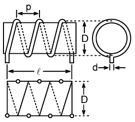
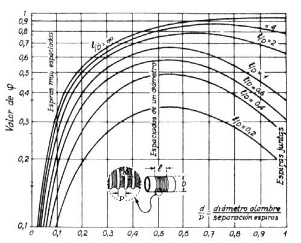

---
jupyter:
  jupytext:
    text_representation:
      extension: .Rmd
      format_name: rmarkdown
      format_version: '1.1'
      jupytext_version: 1.1.1
  kernelspec:
    display_name: Python 3
    language: python
    name: python3
---

<!-- #region -->
# Calculo de inductores solenoides ####



<!-- #endregion -->

```{python}
import  numpy as np 
from solenoide import myCalculate
L = 0.2 #uHy
D =  10    #mm  diametro
d =  1    #mm  diametro de espiras
f = 20   #MHz frecuancia
material = 'hard-drawn copper'# annealed copper, hard-drawn copper, silver, aluminium   

l =  10  #mm  largo

print(np.sqrt(1000*L*(l+0.45*D)/D**2 ))
N = int(np.sqrt(1000*L*(l+0.45*D)/D**2 ) )


myCalculate(D, N, l, d, f,material)
```

<!-- #region -->
# Calculo de inductores solenoides ####


Para calcular un inductor del tipo solenoide emplearemos la fórmula de Harold A. Wheeler

$$L[\mu Hy] = \frac{0.001 \cdot n^2 \cdot D[mm]^2  }{l[mm] + 0.45 \cdot D[mm]} $$ 


n = número de espiras, D = diámetro de la bobina en mm,  l =  longitud del bobinado en mm.

Esta formula tiene una presición menor al 1 porciento para bobinas cuya relación $l/D$ sea mayor que 0,4.  
El diámetro de la bobina se mide entre centros del alambre y supone que el diámetro del alambre es mucho menor que el diámetro de la bobina.


### Calculando el número de espiras del solenoide monocapa

Para calcular el número de espiras, conociendo el diámetro y la longitud del bobinado podemos emplear:

$$ n = \sqrt{ \frac{1000 \cdot L[\mu Hy] \cdot (l[mm] + 0.45 \cdot D[mm])  }{D[mm]^2 }} $$

Q de un solenoide monocapa aplicando la fórmula de R. G. Medhurst

$$ Q = 7.5  \cdot D \cdot \varphi \cdot \sqrt{f[MHz]}  $$



Pueden emplearse las fórmulas de Callender para aproximar (con un poco mas de error a las de Medhurst).

$$ Q =   \frac{1000 \cdot \sqrt{f[MHz]}}{\frac{138}{D[mm]} + \frac{54}{l[mm]}  }  $$


 Callender, M. V. Q of Solenoid Coils, Wireless Engineering, número de Junio de 1947, pag 185.


### La capacidad distribuida de un solenoide monocapa ###

La capacidad distribuida de una bobina (con un extremo conectado a tierra) puede estimarse fácilmente con los datos que del Vademecum tomados del trabajo de Medhurst (2) que también dependen fundamentalmente de consideraciones puramente geométricas.

$$ C[pF] = K \cdot D[mm] $$


|$l/D$ | 0.1 | 0.3  |0.5   | 0.8   |	1    |	2    | 4  	 |     6 |   8   |    10 |	 15  |	 20  |	30  |
|-----|-------|------|------|------|-------|------|-------|-------|-------|-------|-------|-------|------|
|$K $  |0.096  | 0.06 | 0.05 | 0.05  | 0.046 | 0.05  | 0.072 |	0.092| 0.112 | 0.132 | 0.186 | 	0.236| 	0.34|


El $K$ es mínimo para una relación $l/D$ entre 0.5 y 2, por eso si el objetivo es minimizar la capacidad distribuida de nuestras bobinas será usar estas relaciones, sin embargo, dado que el máximo Q se obtiene con relaciones $l/D$ mayores que 1, un buen compromiso podría ser una $l/D$ cercana a 2.

 Medhurst, R G., HF Resistance and Self Capacitance of Single-Layer Solenoids, Wireless Engineering, número de Marzo de 1947, pag 80.
 
<!-- #endregion -->

<!-- #region -->
# Verificaciones


El paso del bobinado de un inductor tipo solenoide de una capa se define como:

$p \equiv \frac{\ell}{N} $


El factor de proximidad $\Phi$ se obtine de los los datos empericos de Medhurst.1,2

$\Phi=f_\text{Medhurst}\left(\frac{\ell}{D},\frac{p}{d}\right) $


El diametro efectivo  $D_{eff}$, se puede expresar aproximadamente como:

$ D_\text{eff} = D - d \cdot \left(1 - \frac{1}{\sqrt{\Phi}}\right) $

### Factores de Correción ###

$ k_ {L} $ es el factor de corrección de no uniformidad de campo de acuerdo con Lundin.1,3.
La expresión de bobina corta proporciona un valor que coincide mejor con el resultado de AGM.1


Para bobinas cortas $\ell \leqslant D_\text{eff}$

$$\begin{split} k_\text{L} = \frac{2\ell}{\pi D_\text{eff}}\;\left[ \frac{1 + 0.383901\;\left(\frac{\ell}{D_\text{eff}}\right)^2 + 0.017108\;\left(\frac{\ell}{D_\text{eff}}\right)^4}{1 + 0.258952\;\left(\frac{\ell}{D_\text{eff}}\right)^2}\;\left[\ln{\frac{4D_\text{eff}}{\ell}} - 0.5\right]\\ + 0.093842\;\left(\frac{\ell}{D_\text{eff}}\right)^2 + 0.002029\;\left(\frac{\ell}{D_\text{eff}}\right)^4 - 0.000801\;\left(\frac{\ell}{D_\text{eff}}\right)^6 \right] \end{split}$$

Para bobinas largas $\ell > D_\text{eff}$

$$k_\text{L} = \frac{1 + 0.383901\;\left(\frac{D_\text{eff}}{\ell}\right)^2 + 0.017108\;\left(\frac{D_\text{eff}}{\ell}\right)^4}{1 + 0.258952\;\left(\frac{D_\text{eff}}{\ell}\right)^2} - \frac{4D_\text{eff}}{3\pi\ell}$$

$ k_ {s} $ es el factor de corrección para la autoinducción del conductor de acuerdo con Knight y Rosa1,4,5.

$$k_\text{s} = \frac{5}{4} - \ln{\left(2\,\frac{p}{d}\right)}$$


$ k_ {m} $ es el factor de corrección para la inductancia mutua entre los devanados conductores según Knight.1,6

$$k_{\text{m}} = \ln{(2\pi)} - \frac{3}{2} - \frac{\ln{(N)}}{6N} - \frac{0.33084236}{N} - \frac{1}{120N^3} + \frac{1}{504N^5} - \frac{0.0011925}{N^7} + \frac{c_9}{N^9}$$

donde $c_9 = -\ln{(2\pi)} +\frac{3}{2} +0.33084236 +\frac{1}{120} -\frac{1}{504} +0.0011925$

### Resistencia serie efectiva en AC###

Las longitudes físicas y efectivas del conductor de alambre derivadas del teorema de Pitágoras:

$$\ell_\text{w,phys} = \sqrt{(N \pi D)^2 + \ell^2}$$

$$\ell_\text{w,eff} = \sqrt{(N \pi\,D_\text{eff})^2 + \ell^2}$$

The skin depth $\delta_\text{i}$ a las frecuencias de diseño $f$ es dada por:9

$$\delta_\text{i} = \sqrt{ \frac{\rho}{\pi f \mu_0\,\mu_\text{r,w}} }$$

En la frecuencia de diseño, la resistencia de CA en serie efectiva $ 𝑅_ {eff} $, de la bobina de alambre es: 9

$$R_{\text{eff,s}} = \frac{\rho\;\:\ell_\text{w,eff}}{\pi\,(d\,\delta_\text{i} - \delta_\text{i}^2)}\,\Phi\,\frac{N - 1}{N}$$

En un loop Simple, el factor de corrección por proximdad $\frac{N - 1}{N}$ in la formula anterior es reemplazado por 1.

#### Fórmula geométrica corregida ####
La inductancia en serie independiente de la frecuencia $L_s$ de la fórmula geométrica de la bobina de la hoja actual, corregida por falta de uniformidad de campo y autoinductancia del conductor redondo y acoplamiento mutuo es: 1,3–6

$$L_\text{s} = \mu_0\left[\pi\frac{(D_\text{eff} N)^2}{4\ell} - D_\text{eff} N\frac{k_\text{s} + k_\text{m}}{2}\right]$$

### Impedancia característica del modo de guía de onda de la hélice de la funda ###
El ángulo de cabeceo efectivo se calcula a partir de la trigonometría:

$$\psi = \arctan{\frac{p}{\pi\,D_\text{eff}}}$$

Hertz demostró que un campo electromagnético arbitrario en un medio isotrópico lineal homogéneo libre de fuente puede definirse en términos de un potencial vectorial único $\Pi$ .16 Suponiendo una dependencia del tiempo $e^{jωt}$, en una onda en espacio el campo potencial vectorial se puede escribir como:


$$\vec{\Pi}(x) = \vec{\Pi}(0) e^{-\gamma x} $$

La constante de propagación $ \ gamma $ es una cantidad compleja:

$$\gamma = \alpha + j \beta$$

donde $\alpha$ es la constante de atenuación, y $\beta$ es la fase constante.

Sin embargo, dado que la atenuación en un medio aéreo es insignificante, es costumbre escribir la ecuación de onda únicamente en función de una constante de fase compleja $\beta$:

$\vec{\Pi}(x) = \vec{\Pi}(0) e^{-j\beta x}$

donde $\beta = \beta' - j \beta''$

tal que $\gamma \equiv j \beta = j (\beta' - j \beta'') = \beta'' +  j \beta' \Rightarrow \beta'' \equiv \alpha$

La separación de variables en la ecuación de Helmholtz da como resultado una función de dispersión trascendental del solenoide monocapa que debe resolverse numéricamente para el número de onda transversal (radial) $\tau$:

$${k_0}^2 \frac{ \text{K}_1(\tau a)\;\text{I}_1(\tau a) }{ \text{K}_0(\tau a)\;\text{I}_0(\tau a) } = \tau^2 \tan^2(\psi)$$

dónde:
el radio efectivo $a = \frac{D_{eff}}{2} $
el número de onda angular del espacio libre ${k_0} \equiv \frac{\omega}{c_0} = \frac{2\pi}{\lambda_0}$  y
el número de onda transversal  $\tau^2 = -\left(\gamma^2 + {k_0}^2\right) = \beta^2 - {k_0}^2$

$\Rightarrow \beta = \sqrt{{k_0}^2 + \tau^2}$

La impedancia característica $Z_c$ del modo de guía de onda de solenoide monocapa $n = 0$ a la frecuencia de diseño viene dada por: 7

$$Z_\text{c} = \frac{60\beta}{k_0}\,\text{I}_0(\tau a)\;\text{K}_0(\tau a)$$

#### Fórmula L corregida ###

$$L_\text{eff,s} = \frac{Z_\text{c}}{\omega}\,\tan(\beta\,\ell)\;k_\text{L} - \mu_0 D_\text{eff} N\frac{k_\text{s} + k_\text{m}}{2}$$

#### Circuito equivalente efectivo ####

$$X_\text{eff,s} = \omega L_\text{eff,s}$$

$$Q_\text{eff} \equiv \frac{X_\text{eff,s}}{R_\text{eff,s}}$$

#### Circuito equivalente agrupado ####
Para calcular el circuito equivalente agrupado, primero el circuito equivalente serie efectivo conocido se convierte a su versión paralela:

$$R_\text{eff,p} = \left(Q_\text{eff}^2 + 1\right) R_\text{eff,s} \qquad$$
$$X_\text{eff,p} = \frac{Q_\text{eff}^2 + 1}{Q_\text{eff}^2} X_\text{eff,s}$$


Del mismo modo, el circuito equivalente agrupado se puede convertir en un circuito con solo componentes paralelos, en el que $Q_L$ y $R_s$ permanecen desconocidos:

$$R_\text{p} = \left(Q_L^2 + 1\right) R_\text{s} \qquad$$
$$X_{L_\text{p}} = \frac{Q_L^2 + 1}{Q_L^2} X_{L_\text{s}}$$

Se pueden escribir tres identidades más; el primero establece que las resistencias paralelas en ambos circuitos equivalentes son una y la misma:

$$R_\text{p} = R_\text{eff,p} \qquad$$
$$Q_L \equiv \frac{X_{L_\text{s}}}{R_\text{s}} \qquad$$
$$X_{L_\text{s}} = \omega L_\text{s}$$

La sustitución permite escribir una ecuación cuadrática reducida en $Q_L$:

$$R_\text{p} = \left(Q_L^2 + 1\right) \frac{X_{L\text{s}}}{Q_L} \quad \Rightarrow \quad Q_L^2 - \frac{R_\text{p}}{X_{L\text{s}}} Q_L +1 = 0$$


Esto produce las siguientes soluciones para $Q_L$ y $R_s$:

$$Q_L = \frac{R_\text{p}}{2 X_{L\text{s}}} + \sqrt{\left(\frac{R_\text{p}}{2 X_{L\text{s}}}\right)^2 - 1} \qquad$$
$$R_\text{s} = \frac{X_{L_\text{s}}}{Q_L}$$

En este punto, se conocen $X_\text{eff,p}$ y su componente $X_{Lp}$. Por lo tanto, la capacidad parásita paralela $C_p$ en la frecuencia de diseño ahora se puede extraer:

$$\frac{1}{X_{C_\text{p}}} = \frac{1}{X_\text{eff,p}} - \frac{1}{X_{L_\text{p}}} = \frac{X_{L_\text{p}} - X_\text{eff,p}}{X_\text{eff,p}\:X_{L_\text{p}}} \quad
\Rightarrow \quad X_{C_\text{p}} = \frac{X_\text{eff,p}\:X_{L_\text{p}}}{X_{L_\text{p}} - X_\text{eff,p}}$$

$$C_\text{p} = -\frac{1}{\omega X_{C_\text{p}}}$$


Frecuencia autorresonante
La frecuencia de autorresonancia se aproxima dejando:

$$\beta\ell \rightarrow \frac{\pi}{2}$$

donde:
$k_0 = \sqrt{\beta^2 - \tau^2}$


la función de dispersión trascendental para el solenoide monocapa se resuelve numéricamente para el número de onda transversal (radial) $\tau$,

$\omega = k_0 c_0$ and $f_\text{res} = \frac{\omega}{2 \pi}$

<!-- #endregion -->

References
1. David W. Knight, G3YNH. Solenoid inductance calculation. From transmitter to antenna. 2007–2016. Available at: http://www.g3ynh.info/zdocs/magnetics/part_1.html.
2. R. G. Medhurst. H.F. resistance and self-capacitance of single-layer solenoids. Wireless Engineer. 1947:35-43 & 80-92. Available at: http://hamwaves.com/inductance/doc/medhurst.1947.pdf.
3. Richard Lundin. A handbook formula for the inductance of a single-layer circular coil. Proc IEEE. 1985;73(9):1428-1429. Available at: http://lup.lub.lu.se/record/144380/file/625001.pdf.
4. Edward B. Rosa. Calculation of the self-inductance of single-layer coils. Bulletin of the Bureau of Standards. 1906;2(2):161-187. Available at: http://hamwaves.com/inductance/doc/rosa.1906.pdf.
5. E. B. Rosa, F. W. Grover. Formulas and tables for the calculation of mutual and self-induction [revised]. S. W. Stratton, ed. Bulletin of the Bureau of Standards. 1916;(169):122. Available at: http://hamwaves.com/inductance/doc/rosa.1916.3ed.pdf.
6. David Knight, Rodger Rosenbaum. Grover’s ’Inductance Calculations’ supplementary information and errata. 2012:150. Available at: http://hamwaves.com/inductance/doc/knight.2012.pdf.
7. Kenneth L. Corum, James F. Corum. RF coils, helical resonators and voltage magnification by coherent spatial modes. Microwave Review (IEEE). 2001;7(2):36-45. Available at: http://hamwaves.com/inductance/doc/corum.2001.pdf.
8. Robert E. Collin. Foundations for microwave engineering. In: 2nd ed. Wiley-IEEE Press; 2001:580-583.
9. David W. Knight, G3YNH. Inductor losses and Q. From transmitter to antenna. 2007–2016. Available at: http://www.g3ynh.info/zdocs/magnetics/solenz.html.
10. Hank Meyer, W6GGV. Accurate single-layer-solenoid inductance calculations. QST. 1992:76-77. Available at: http://p1k.arrl.org/pubs_archive/87777.
11. Hank Meyer, W6GGV. Corrections to accurate single-layer solenoid inductance calculations. QST. 1992:73. Available at: http://p1k.arrl.org/pubs_archive/88067.
12. T. J. Dekker, W. Hoffmann (part 2). Algol 60 Procedures in Numerical Algebra, Parts 1 and 2. Mathematisch Centrum Amsterdam; 1968.
13. T. J. Dekker. Finding a zero by means of successive linear interpolation. In: Dejon B, Henrici P, eds. Constructive Aspects of the Fundamental Theorem of Algebra. New York; 1969.
14. Cleve Moler. Zeroin, part 1: Dekker’s algorithm. 2015. Available at: https://blogs.mathworks.com/cleve/2015/10/12/zeroin-part-1-dekkers-algorithm/.
15. L. F. Shampine, H. A. Watts. FZERO.F in SLATEC Common Mathematical Library, version 4.1. 1993. Available at: https://www.netlib.org/slatec/src/fzero.f.
16. Stratton JA. Electromagnetic Theory. McGraw-Hill; 1941.
5


```{python}

```
