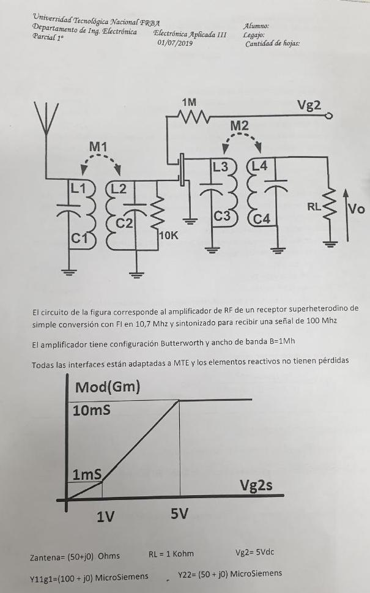
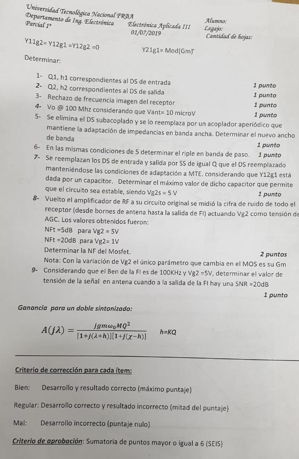
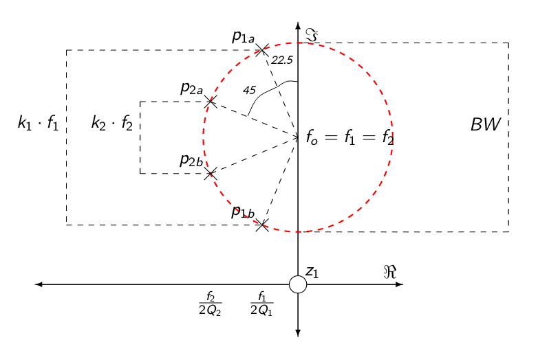

---
jupyter:
  jupytext:
    text_representation:
      extension: .Rmd
      format_name: rmarkdown
      format_version: '1.1'
      jupytext_version: 1.1.1
  kernelspec:
    display_name: Python 3
    language: python
    name: python3
---


 





NOTA : T = 300 K

# Respuesta 1

La figura ilustra la ubicación de los polos de los dobles sintonizados. 



De la figura, los polos correspondientes al primer doble sintonizado permiten calcular $Q$,$k$ y $h$ en base a su ubicación. 

$f_o = 100 MHz$

$BW = 1 MHz$

$Q_1  = \frac{f_o}{2 \cdot \frac{BW}{2} \cdot sin(\frac{45}{2})} = 261.31$

$K_1  = \frac{BW \cdot cos(\frac{45}{2})}{fo}  = 0.0092$

## $h_1  = Q_1 \cdot  K_1  = 2.41$


# Respuesta  2

De igual manera para el segundo doble sintonizado:

$Q_2  = \frac{f_o}{2 \cdot \frac{BW}{2} \cdot sin(45 + \frac{45}{2})} = 108.23$

$K_2  = \frac{BW \cdot cos(45+\frac{45}{2})}{fo}  = 0.0038$

## $h_2  = Q_2 \cdot  K_2  = 0.41$


# Respuesta  3 

Usando la transferencia del filtro Butterworth:

$|A| = \frac{1}{\sqrt{1 +  (\frac{f_{imag} - f_o}{f_c - f_o}})^{2\cdot3} }$

$|A| = \frac{1}{\sqrt{1 +  (\frac{2 \cdot 10.7MHz}{\frac{1MHz}{2}}})^{6} } = 1.27 \times 10^{-05}$

## $|A| = -97.88dB$


<!-- #region -->
# Respuesta  4

$|A_o| = \frac{1}{2} \cdot gm \cdot \frac{r_{22}}{2}$


$|A_o| = \frac{1}{2} \cdot 10mS \cdot \frac{20K\Omega}{2} = 50.0$

## $v_o = |A_o| \cdot 10 \mu V  = 500 \mu V$ 

<!-- #endregion -->

<!-- #region -->
# Respuesta  5

$A(\chi) = \frac{j gm M w_o Q^2  }{(1+j(\chi+h))(1+j(\chi-h)) }$ 

$A(\chi_o) = \frac{j gm M w_o Q^2  }{(1+j(h))(1+j(h)) } = \frac{j gm M w_o Q^2  }{(1+h^2) }$ 

$\bar{A}(\chi) = \frac{A(\chi)}{A(\chi_o)} = \frac{1+h^2 }{ (1+j(\chi+h))(1+j(\chi-h)) }$ 


$| \bar{A}(\chi) | =  \frac{1+h^2 }{\sqrt{\chi^4+2\chi^2(1-h^2)+(1+h^2)^2} } = \frac{1}{\sqrt{2}}$ 


$| \bar{A}(\chi) | =  \frac{(1+h^2)^2 }{\chi^4+2\chi^2(1-h^2)+(1+h^2)^2}  = \frac{1}{2}$ 

$\chi^4+2\chi^2(1-h^2)+(1+h^2)^2 = 2 \cdot (1+h^2)^2$

$\chi^4+2\chi^2(1-h^2) =  (1+h^2)^2$

$\chi^4+2\chi^2(1-h^2)   - (1+h^2)^2 = 0$

$\chi^4+2\chi^2(1-2.41^2)   - (1+2.41^2)^2 = 0$

$a = 1$

$b =  2 \cdot (1-2.41^2) = -9.61$

$c =  - (1+2.41^2)^2 = -46.35$ 

$x = \frac{-b + \sqrt{b^2- 4 \cdot a \cdot c}}{2 \cdot a} = 13.138$

$\chi = \sqrt{x} = 3.62$

$\frac{BW}{2} = \frac{\chi \cdot fo }{2 \cdot Q}$

$BW = \frac{ 3.62 \cdot 100 \times 10^{6}}{261}= 1.38\times 10^{6}$

## $BW =  1.38\times 10^{6}$
<!-- #endregion -->

<!-- #region -->
# Respuesta  6
Buscamos los máximo y mánimos de la transferencia:

$\frac{d}{d\chi} (\chi^4+2\chi^2(1-h^2)+(1+h^2)^2)= 0$ 


$4 \chi^3 + 4\chi(1-h^2) = 0$ 

$\chi = 0$

$4 \chi^2 = - 4 (1-h^2)$ 

$\chi^2  = h^2 - 1$ 

$\chi^2  = h^2 - 1 =  4.8$ 

$\chi   = 2.192$ 


Tranferencia $\chi = 0$:  

$| \bar{A}(\chi= 0) | =  \frac{1+(2.41)^2 }{\sqrt{0^4+2\cdot 0^2 \cdot (1-(2.41)^2)+(1+(2.41)^2)^2} }$ 

$| \bar{A}(\chi= 0) | =  \frac{1+(2.41)^2 }{(1+(2.41)^2)} = 1$ 

Tranferencia $\chi = 2.192$:  

$| \bar{A}(\chi= 0) | =  \frac{1+(2.41)^2 }{\sqrt{2.192^4+2\cdot 2.192^2 \cdot (1-(2.41)^2)+(1+(2.41)^2)^2} } = 1.412$ 


## Por lo tanto el ripple en la banda de paso es de $1.4$ 0 $3 dB$.
<!-- #endregion -->

<!-- #region -->
# Respuesta  7

Stern:
$K = \frac{2 \cdot \Re(y_{11} + y_{11}) \cdot \Re(y_{22}+ y_{22})}{| y_{12} \cdot y_{21} | +\Re(y_{12} \cdot y_{21})}$

$\frac{2 \cdot 2 \cdot \Re(y_{11}) \cdot 2 \cdot \Re(y_{22})}{| y_{12} \cdot y_{21} | +\Re(y_{12} \cdot y_{21})} =1$

$| y_{12} \cdot y_{21} | +\Re(y_{12} \cdot y_{21}) = 8 \cdot \Re(y_{11}) \cdot \Re(y_{22})$


Recordando :

$y_{12} = -j \cdot \omega C$

$y_{21} = gm$

$y_{12} \cdot y_{21}  =  -j \cdot \omega C \cdot gm$

$| y_{12} \cdot y_{21} | =  \omega C \cdot gm$

$\Re(y_{12} \cdot y_{21}) = 0$

$\omega C \cdot gm = 8 \cdot \Re(y_{11}) \cdot \Re(y_{22})$

$C = \frac{8 \cdot \Re(y_{11}) \cdot \Re(y_{22})}{\omega  \cdot gm}$

$C = \frac{8 \cdot 100 \mu S \cdot 50 \mu S}{2 \pi 100 \times 10^{6}  \cdot 10 mS}  = 6.36 \times 10^{-15}$

## $C =  6.36 \times 10^{-15}$

<!-- #endregion -->

# Respuesta  8

$F_{a}= F_{tr} + \frac{F_{2}- 1}{G_{1a}}$

$gm_{a}^2 \cdot F_{a}= gm_{a}^2 \cdot F_{tr} + \frac{F_{2}- 1}{K_{1a}}$

$\frac{F_{2}- 1}{K_{1a}} = gm_{a}^2 \cdot F_{a} - gm_{a}2 \cdot F_{tr}$

$\frac{F_{2}- 1}{K_{1b}} = gm_{b}^2 \cdot F_{b} - gm_{b}2 \cdot F_{tr}$

$F_{a} = 3.16$

$G_{1a} = gm_{a}^2 \cdot k$

$F_{b} = 100$

$G_{1b} = gm_{b}^2 \cdot k$

$gm_{a}^2 \cdot F_{a} - gm_{a}^2 \cdot F_{tr} = gm_{b}^2 \cdot F_{b} - gm_{b}^2 \cdot F_{tr}$

$(gm_{b}^2  - gm_{a}^2) \cdot F_{tr} = gm_{b}^2 \cdot F_{b} - gm_{a}^2 \cdot F_{b}$

$F_{tr} = \frac{gm_{b}^2 \cdot F_{b} - gm_{a}^2 \cdot F_{b}}{(gm_{b}^2  - gm_{a}^2)} = 2.12$

## $F_{tr} = 2.12$


# Respuesta  9

La  relación de señal a ruido a la salida :

$\frac{S_o}{N_o}  = 100$

$F = \frac{\frac{S_i}{N_i}}{\frac{S_o}{N_o}} =  3.16$

$\frac{S_i}{N_i}  = 316$

$N_i = k_B T B = 1.38 \times 10^{-23} \cdot 300K \cdot 100KHz = 4.14 \times 10^{-16} W$

$S_i = 1.30  \times 10^{-13} W$ 

$V_{irms} = \sqrt{S_i \cdot 2 \cdot 50} = 3.60\times 10^{-6} V$

## $V_{irms} = 3.60\times 10^{-6} V$


```{python}

```

```{python}

```
