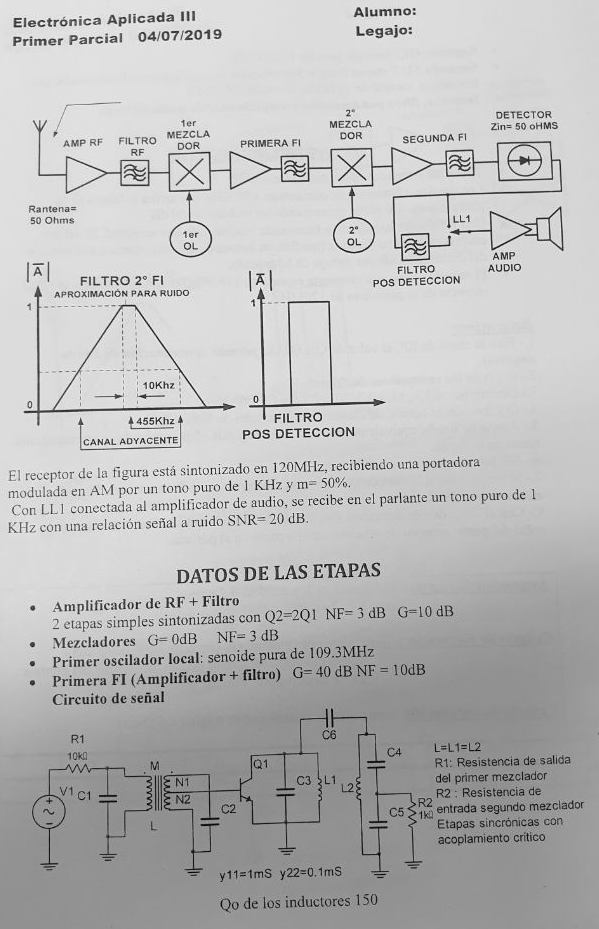
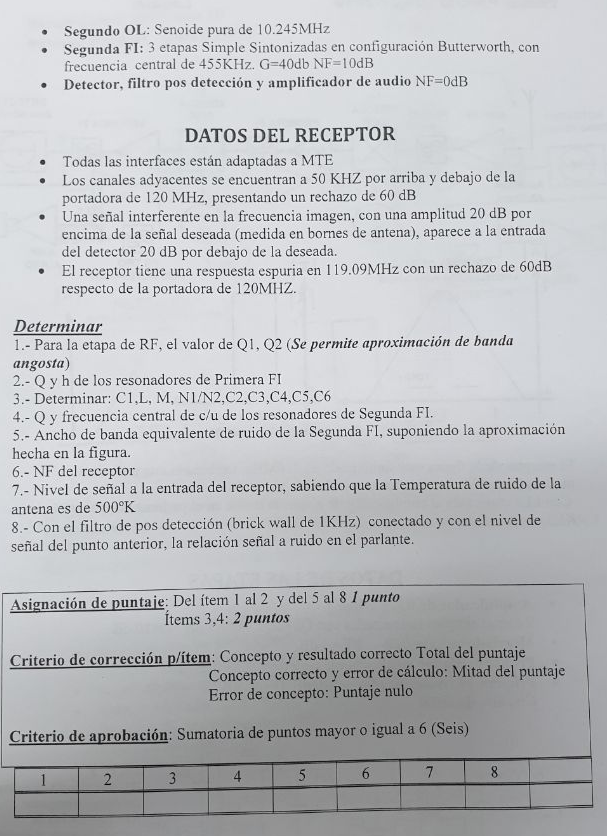

---
jupyter:
  jupytext:
    text_representation:
      extension: .Rmd
      format_name: rmarkdown
      format_version: '1.1'
      jupytext_version: 1.1.1
  kernelspec:
    display_name: Python 3
    language: python
    name: python3
---






<!-- #region -->
# 1


Del enunciado, la frecuencia imagen se atenua $40 dB$. 

Para la etapa de RF, $Qc$ de los sintonizados para cumplir con la condición de filtros sincrónicos y $Q_{c2} = 2 \cdot Q_{c1}$  .


Usando aproximación:

$\frac{1}{\sqrt{1+\chi_1^2}} \cdot \frac{1}{\sqrt{1+\chi_2^2}} = \frac{1}{10^{\frac{40}{20}}}$

$\frac{1}{\sqrt{1+\chi_1^2}} \cdot \frac{1}{\sqrt{1+4 \cdot \chi_1^2}} = \frac{1}{100}$

$\frac{1}{1+\chi_1^2} \cdot \frac{1}{1+4 \cdot \chi_1^2} = \frac{1}{100^2}$


$(1+\chi_1^2) \cdot (1+4 \cdot \chi_1^2) = 10000$

$1+5 \cdot \chi_1^2 +4 \cdot \chi_1^4 = 10000$

$\chi_1 =  7.03$

$\chi_2 =  14.05$

# $Q_1 =  19.70$

# $Q_2 =  39.40$

Sin usar la aproximación:


$\frac{1}{\sqrt{1+Q_1^2\cdot(\frac{fi}{fo}-\frac{fo}{fi})^2}} \cdot \frac{1}{\sqrt{1+Q_2^2\cdot(\frac{fi}{fo}-\frac{fo}{fi})^2}} = \frac{1}{10^{\frac{40}{20}}}$


$\frac{1}{\sqrt{1+Q_1^2\cdot(\frac{fi}{fo}-\frac{fo}{fi})^2}} \cdot \frac{1}{\sqrt{1+(2\cdot Q_1)^2\cdot(\frac{fi}{fo}-\frac{fo}{fi})^2}} = \frac{1}{10^{\frac{40}{20}}}$

$(1+Q_1^2\cdot(\frac{fi}{fo}-\frac{fo}{fi})^2) \cdot (1+ 4\cdot Q_1^2\cdot(\frac{fi}{fo}-\frac{fo}{fi})^2) = 100^2$

$1 + 5\cdot Q_1^2\cdot(\frac{fi}{fo}-\frac{fo}{fi})^2 + 4\cdot Q_1^4\cdot(\frac{fi}{fo}-\frac{fo}{fi})^4 = 10000$

$f_i = f_{osc} - f_{1FI} = 109.7 MHz - 10.7 MHz = 98.6 MHz$

$(\frac{fi}{fo}-\frac{fo}{fi})^2 = (\frac{98.6}{120}-\frac{120}{98.6})^2 = 0.1563$

$-9999 + 5\cdot Q_1^2\cdot(0.1563) + 4\cdot Q_1^4\cdot(0.1563)^2 = 0$

$Q1 =   19.7$

$Q2 =  39.4$


<!-- #endregion -->

<!-- #region -->
# 2
El h de un doble sintonizado con acoplamiento critico es 1. 

En el enunciado dice que el receptor tiene un respuesta espuria en $119.09 MHz$. 

Esta espuria esta dentro de la banda de paso del filtro de RF, por lo tanto no será filtrado por éste. 

Esta espuria luego del primer mezclador produce $9.79 MHz$. Esta frecuencia corresponde a la frecuencia interimagen del segundo mezclador ($10.7 MHz - 2 \cdot 455 KHz$). Es el filtro de primera frecuencia intermedia quien filtra esta señal.


La transferencia para dos dobles sintonizados con acoplamiento critico:

$(\frac{1}{\sqrt{1+\frac{\chi_1^4}{4}}})^2  = \frac{1}{10^{\frac{60}{20}}}$

$1+\frac{\chi_1^4}{4}  = 1000$

$\chi_1  = 7.95$

# $Q = \frac{\chi_1 \cdot 10.7MHz}{4 \cdot 455 KHz} = 46.73$

<!-- #endregion -->

<!-- #region -->
# 3 

### Inductancia
$\frac{1}{Q_c} = \frac{1}{Q_o} + \frac{\omega L}{r_{ext}}$

donde $r_{ext} = 10 K\Omega$

$\omega L =  (\frac{1}{Q_c} - \frac{1}{Q_o}) \cdot  r_{ext}$

$\omega L =  (\frac{1}{46.7} - \frac{1}{150}) \cdot  10K\Omega  = 147.32$


## $L = 2.2 \mu Hy$

$k = \frac{1}{Q}$ 

## $M = L \cdot k = 47 nH$


### Capacidades

## $C_1 = C_2 = C_3  = C_o  =\frac{1}{\omega^2 \cdot L} = 101 pF$

## $C_6 = k \cdot \sqrt{C_3  \cdot C_o} =  471 pF$

#### Divisor capacitivo de la salida 

$Q_{m2}  = r_{ext} \cdot \omega \cdot C_o  = 67.8$

$n = \sqrt{\frac{10k\Omega}{1k\Omega}} = 3.16$

$Q_{m1} = \sqrt{\frac{1+Q_{m2}^2}{nc}-1} = 38.1$

Dado que Qm2 y Qm1 son mayores a 10, puedo emplear las ecuaciones aproximadas 

## $C_4 = n  \cdot C_o = 319 pF$

## $C_5 = \frac{n}{n-1} \cdot C_o = 147 pF$

### Relaciones de vueltas del transformador

$(\frac{N_1 + N_2}{N_2})^2 = \frac{10k\Omega}{1k\Omega}$

$\frac{N_1}{N_2} + 1 = \sqrt{\frac{10k\Omega}{1k\Omega}}$

## $\frac{N_1}{N_2}  = 2.16$


<!-- #endregion -->

<!-- #region -->
# 4

La transferencia del filtro Butterworth:

$|A| = \frac{1}{\sqrt{1 +  (\frac{f_{ca} - f_o}{f_c - f_o}})^{2\cdot3} } =  \frac{1}{10^{\frac{60}{20}}}$

donde: 

$f_{ca} - f_o = 50 KHz$

$(\frac{f_{ca} - f_o}{f_c - f_o})^{6}  =  10^{6}$

$(\frac{50 KHz}{f_c - f_o})^{6}  =  10^{6} - 1$


$(\frac{50 KHz}{f_c - f_o})  =  10$

$f_c =  f_o + \frac{50 KHz}{10}$

Esta frecuencia corresponde al corte superior del filtro. La frecuencia inferior entonces 

$f_c =  f_o - \frac{50 KHz}{10}$

El ancho de banda del filtro es entonces:

$BW =  10 KHz$


Los polos entonces:

Primer polo (superior):

## $f_1 =  f_o + \frac{BW}{2}  \cdot cos(30) = 459.3KHz$

## $Q_1 =  \frac{f_1}{2 \cdot \frac{BW}{2}  \cdot sin(30)} = 91.8$


Segundo polo:

## $f_2 =  f_o = 455 KHz$

## $Q_2 =  \frac{f_2}{2 \cdot \frac{BW}{2}  \cdot sin(0)} = 45.9$

Tercer polo:
## $f_3 =  f_o - \frac{BW}{2}  \cdot cos(30) = 450.6 KHz$

## $Q_3 =  \frac{f_3}{2 \cdot \frac{BW}{2}  \cdot sin(30)} = 91.8$

<!-- #endregion -->

# 5 Ancho de banda equivalente

$B_{eq}=\int_{0}^{\infty} |\bar{A}|^2 df$

$B_{eq}= 2 \cdot \int_{0}^{45KHz} (\frac{1}{45KHz} \cdot f)^2 df +  \int_{0}^{10KHz} (1)^2 df = 40 KHz$

## $B_{eq}= 40 KHz$

<!-- #region -->
#  6 Cifra de Ruido total


$$F_{tot}=F_{1} + \frac{F_{2}- 1}{G_{1}} + \frac{F_{3}- 1}{G_{1} \cdot G_{2} } + \frac{F_{4}- 1}{G_{1} \cdot G_{2} \cdot G_{3} } + \frac{F_{5}- 1}{G_{1} \cdot G_{2} \cdot G_{3} \cdot G_{4} }  $$

$$F_{tot}= 2 + \frac{2- 1}{10} + \frac{10- 1}{10 \cdot 1 } + \frac{2- 1}{10 \cdot 1 \cdot 10000 } + \frac{10- 1}{10 \cdot 1 \cdot 10000 \cdot 1 }  =  3$$

## $$F_{tot} =  3$$

<!-- #endregion -->

# 7

La  relación de señal a ruido a la salida :

$\frac{S_o}{N_o}  = 100$

$F = \frac{\frac{S_i}{N_i}}{\frac{S_o}{N_o}} =  3$

$\frac{S_i}{N_i}  = 300$

$N_i = k_B T B = 1.38 \times 10^{-23} \cdot 500K \cdot 40KHz = 2.76 \times 10^{-16} W$

## $S_i = 8.28  \times 10^{-14} W$ 


<!-- #region -->
# 8


$N_i = k_B T B = 1.38 \times 10^{-23} \cdot 500K \cdot 1KHz = 6.9 \times 10^{-16} W$

$S_1 = 8.28  \times 10^{-14} W$ 

$\frac{S_i}{N_i} = 12000$

$\frac{S_o}{N_o}  = \frac{\frac{S_i}{N_i} }{3} = 4000$

## $\frac{S_o}{N_o}  =  36 dB$
<!-- #endregion -->

```{python}

```

```{python}

```

```{python}

```
